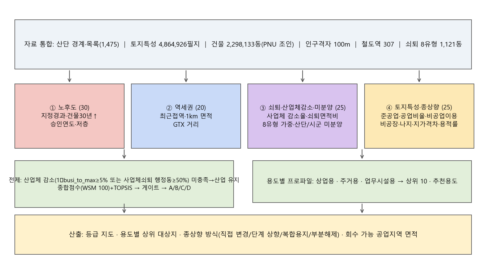
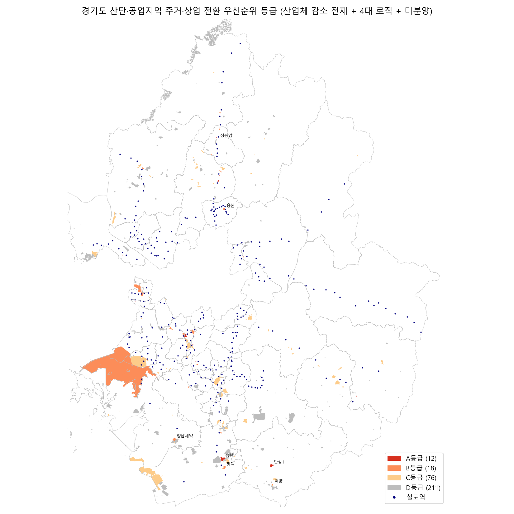
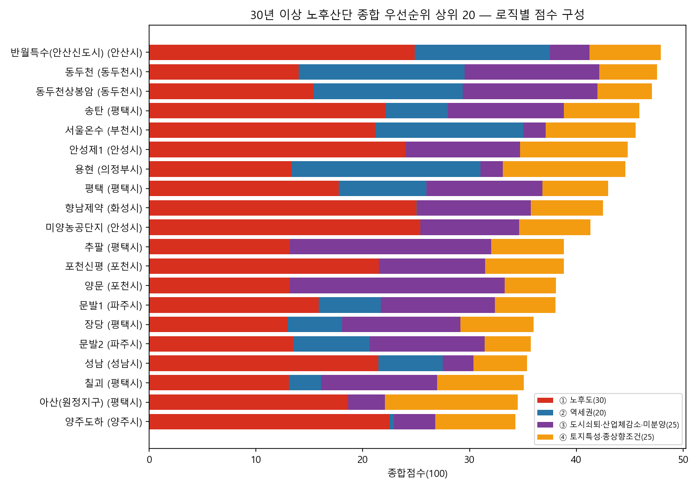
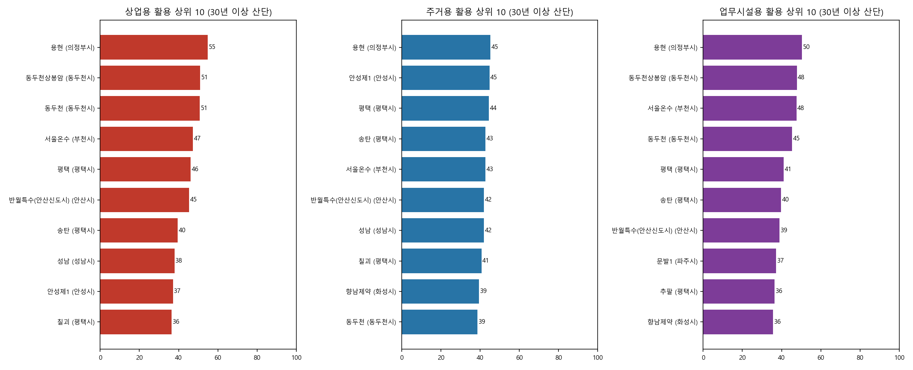

# 경기도 노후산단 분석 — 진행 내용과 결과 (2026-09-18 v6: 미분양 지표 추가 · 산단 경계 분양현황 단지코드 연결)

> 목적: 경기도 첨단산단 조성에 필요한 **공업지역 물량**을, 산업기능을 잃은 노후산단·공업지역을 주거·상업으로 전환해 회수하고 재배분하는 방안을 뒷받침하는 공간분석.
> 자료 폴더: `G:\내 드라이브\000.GIS_2024\1_산업단지` (완성본은 `gpkg/`, 결과표·그림은 `output/`)

---

## 1. 구축한 데이터

| 자료 | 원본 | 결과 | 규모 |
|---|---|---|---|
| 산업단지 목록 | 산업입지정보망 목록 xlsx (전국 1,475) | `산업단지목록.gpkg` (포인트) | 지오코딩 1,447/1,475 성공 (네이버 1,403 · 카카오 44) |
| 산단 경계 | DAM_DAN(단지경계 1,363) + 분양현황(2026.7) 단지코드 + 유치업종도면(DAM_YUCH 17,438필지) | `산업단지목록_분양현황매칭_경계유치업종도면(_gg).gpkg` — 분양현황 단지코드=DAN_ID 로 직접 연결(1,356), 지오코딩 보조(106); `노후년도`·분양·유치업종 속성 | 전국 1,462 연결, **경기 229 중 228 연결(고유 경계 215)** |
| 토지특성 | 국가공간정보포털 AL_D194(43개 시군구 SHP) + AL_D195(속성 CSV) | `gg_토지특성정보.gpkg` — 필지 폴리곤 + 지목·용도지역·토지이용상황·공시지가 26개 속성 | **4,864,926 필지** (통합 완료) |
| 건축물 | GIS건물통합정보 AL_D010 (3분할) | `gg_building.gpkg` — 사용승인일·용도·구조·연면적·층수·위반여부 + 소속 100m 격자 | **2,298,133동** (통합 완료) |
| 인구 격자 | SGIS 100m 격자 | `pop_total.gpkg` → `pop_total_building.gpkg` (격자별 건물수·평균승인연도·30년 이상 비율 조인) | 1,029,094칸 |
| 철도역 | 경기 철도역 307 (GTX 포함) | `gg_station_307_road_new_new.gpkg` | 307 |
| 행정구역 | 2026 시도·시군구·읍면동 | `행정구역2026_utf8.gpkg` (인코딩 정리) | 16 / 256 / 5,067 |

### 지오코딩·경계 매칭 방법
1. 주소 정제("일원·번지" 제거 → 실패 시 지번 제거 → 읍면동까지 단계 축약) 후 **네이버 → 카카오** 순으로 지오코딩
2. 경계 연결: ① 분양현황 단지코드 = DAM_DAN DAN_ID(직접 연결, 1,356) → ② 없으면 지오코딩 좌표 기반 5단계 매칭(포함·3km 동명·유일 이름·5km 부분일치·2km 공통어절) → 하위지구(시화 1단계·MTV 등)는 상위 경계에 연결
3. 경기 미연결 1개는 반월특수지역(여러 시군 포괄 항목)

---

## 2. 경기도 산업단지 노후도 현황 (목록 기준, 2026년)

- 경기도 산단 **229개** (일반 194 · 도시첨단 17 · 국가 17 · 농공 1)
- 지정 후 **20년 이상 83개 (36%)**, **30년 이상 47개 (21%)**, 40년 이상 13개
- 1970~80년대 지정된 반월·시화(안산·시흥), 아산(평택), 성남일반, 서울온수(부천), 안성1·2 등이 도시 내부로 편입돼 주거지와 혼재
- 과밀억제권역 14개 시에 위치한 20년 이상 산단은 11개 — 이곳의 공업지역은 신규 지정이 금지된 "제로섬" 물량이므로 전환 시 회수 가치가 가장 높음

---

## 3. 역세권(철도역 1km) 안에 들어오는 산업단지 영역

철도역 307개 반경 1km 버퍼와 경기 산단 경계(215개 폴리곤)를 교차해 **역세권에 걸치는 산단 면적**을 산출했다.

| 항목 | 값 |
|---|---|
| 역세권에 걸치는 산단 | **29개** / 215 |
| 역세권 내 산단 면적 합계 | **1,630 ha** (전체 산단 면적 25,978 ha의 6.3%) |
| GTX 역세권(1km) 산단 | 1개 |

### 역세권 포함 면적 상위
| 산업단지 | 유형 | 노후년도 | 산단면적 ha | 역세권 내 ha | 비율 | 해당 역 |
|---|---|---|---|---|---|---|
| 반월특수(안산신도시) [재생사업지구] | 국가 | 49 | 1,442 | 632 | 0.44 | 초지·안산·고잔·원시·시우 |
| 시화지구(1단계) / 반월특수(시화) | 국가 | 40 | 13,530 | 363 | 0.03 | 원시·한대앞·국제테마파크·서화성남양 |
| 광명시흥 일반·도시첨단 | 일반 | 8 | 98 | 87 | 0.89 | 학온 |
| 월롱 | 일반 | 20 | 84 | 72 | 0.86 | 문산기지 |
| 화성 일반 | 일반 | 29 | 98 | 67 | 0.68 | 서천·나노시티·능동·메타 |
| 수원델타플렉스 1·3블록 | 일반 | 23 | 85 | 44 | 0.52 | 고색 |
| 파주센트럴밸리 | 일반 | 8 | 49 | 38 | 0.78 | 파주 |
| 용현 (의정부) | 일반 | 31 | 36 | 36 | 1.00 | 효자·탑석·어룡·송산·곤제·경기도청북부청사 |
| 남양주왕숙 도시첨단 | 도시첨단 | 1 | 120 | 30 | 0.25 | 퇴계원·사릉 |
| 동두천 일반 | 일반 | 32 | 26 | 26 | 1.00 | 동두천 |
| 매화 (시흥) | 일반 | 13 | 38 | 26 | 0.68 | 매화 |
| 안양평촌스마트스퀘어 | 도시첨단 | 14 | 26 | 26 | 1.00 | 평촌·인덕원·안양운동장 |
| 군포첨단 | 일반 | 13 | 29 | 19 | 0.67 | 의왕 |
| 서울온수 (부천) | 일반 | 56 | 16 | 10 | 0.63 | 역곡 |
| 평택 일반 [재생사업지구] | 일반 | 35 | 54 | 7 | 0.12 | 평택지제 |

**읽는 법**: 노후년도가 크고(30년↑) 역세권 비율이 높은 곳 — **반월(안산신도시) 632ha, 용현 36ha, 동두천 26ha, 서울온수 10ha, 화성일반 67ha, 수원델타플렉스 44ha** — 가 "역세권 상업·업무 복합 전환" 1차 후보다. 광명시흥·파주센트럴밸리·평촌스마트스퀘어처럼 신규(10년 내)인 곳은 역세권이어도 전환 대상이 아니라 보호·고도화 대상이다.

- 자료: `station_1km_area.json`(역세권 교차 폴리곤, WGS84), `station_1km_summary.json`(산단별 표), `map_station_1km.png`
- GPKG: `gpkg/산업단지_역세권1km.gpkg` (역세권_1km / 산업단지_역세권교차영역 / 산업단지_역세권요약)

---

## 4. 전환 우선순위 분석 결과 (2026-09-18 v6: 미분양 지표 추가)

**0단계 · 산업체 감소 전제**: 행정동 사업체 수 최대치 대비 감소율 ≥ 5% 또는 도시재생법 사업체 쇠퇴 행정동 면적 ≥ 50% → 통과. 미충족이면 「산업 유지」(C).

**4대 로직(100점)**: ① 노후도 30 ② 역세권 20 ③ **도시쇠퇴·산업체감소·미분양 25**(사업체 감소율 8·쇠퇴 면적비 5·8유형 가중 7·**산단 미분양율 3(0~30%)·시군 산단 미분양율 2(0~20%)**) ④ 토지특성·종상향 조건 25. 미분양(분양현황 2026.7)은 산업용지 수요가 소진됐음을 뜻하므로 전환 정당성을 높이는 지표 — 산단 자체가 완판이어도 같은 시군 신규 산단이 대량 미분양이면 지역 산업용지 수요가 약한 것으로 봄. 경기 산단 229곳 모두 분양자료 있음(미분양 있는 곳 36, 시군 미분양율 상위: 고양 92%·동두천 33%·연천 23%·양주 14%).

| 항목 | 값 |
|---|---|
| 분석 단위 | 산단 215 + 산단 외 공업지역 클러스터 102 = 317 |
| 산업체 감소 전제 충족 / 미충족 | 240 / 30 |
| 30년 이상·조성완료 산단(핵심 대상) | 41 |
| 등급(전체) | A 12 · B 18 · C 76 · D 211 |
| 등급(산단) | A 3 · B 5 · C 22 · D 185 |
| 산단 A등급 | 동두천상봉암, 송탄, 안성제1 |
| 회수 가능 공업지역 | **874 ha** (A등급 288 ha) |

### 4.1 30년 이상 노후산단 유형화
| 유형 | 개소 | 면적 ha | 건물 30년↑ | 종합점수 | A/B | 대표 산단 |
|---|---|---|---|---|---|---|
| Ⅰ 역세권·산업쇠퇴형 | 5 | 209 | 26% | 43.9 | 2/1 | 동두천, 동두천상봉암, 송탄 |
| Ⅱ 역세권·비쇠퇴형 | 4 | 1,641 | 25% | 43.4 | 0/1 | 반월특수(안산신도시), 서울온수, 용현 |
| Ⅲ 비역세권·산업쇠퇴형 | 26 | 769 | 15% | 33.6 | 1/2 | 안성제1, 향남제약, 미양농공단지 |
| Ⅳ 비역세권·비쇠퇴형 | 6 | 1,458 | 33% | 30.0 | 0/0 | 아산(원정지구), 양주도하, 반월도금 |

### 4.2 종합 우선순위 상위 15 (30년 이상 산단)
「미분양 산단/시군」 = 산단 자체 미분양율 / 같은 시군 산단 전체 미분양율(공고면적 가중). 「내부」·「주변300m」 = 건축물 용도 연면적 비율(주거/상업/업무).

| 순위 | 산업단지 | 시군 | 노후 | ha | 최근접역 | 쇠퇴유형(사업체↓) | 미분양 산단/시군 | 준공업 | 30년↑건물 | 내부 주거/상업/업무 | 주변300m 주거/상업/업무 | 점수 | 등급 | 종상향 방식 |
|---|---|---|---|---|---|---|---|---|---|---|---|---|---|---|
| 1 | 반월특수(안산신도시) | 안산시 | 49 | 1,449 | 원시역 0m | 인구건물쇠퇴지역 (↓1%) | 0%/1% | 0% | 58% | 0%/1%/0% | 23%/12%/6% | 47.9 | C | – |
| 2 | 동두천 | 동두천시 | 32 | 26 | 동두천역 136m | 인구산업쇠퇴지역 (↓0%) | 0%/33% | 0% | 1% | 0%/1%/0% | 54%/9%/0% | 47.5 | D | – |
| 3 | 동두천상봉암 | 동두천시 | 31 | 5 | 소요산역 607m | 인구산업쇠퇴지역 (↓0%) | 0%/33% | 0% | 21% | 0%/0%/0% | 20%/52%/0% | 47.1 | A | 일반공업→준공업→준주거·상업 단계 상향 (역세권 지구단위계획) |
| 4 | 송탄 | 평택시 | 35 | 108 | 평택지제역 1,258m | 산업건물쇠퇴지역 (↓0%) | 0%/2% | 0% | 73% | 0%/2%/0% | 59%/17%/0% | 45.9 | A | 일반공업→제3종일반주거(역세권 준주거) 변경, 공공주택지구 병행 |
| 5 | 서울온수 | 부천시 | 56 | 5 | 역곡역 711m | 인구쇠퇴지역 (↓0%) | 0%/0% | 94% | 20% | 1%/1%/0% | 92%/4%/0% | 45.6 | C | – |
| 6 | 안성제1 | 안성시 | 48 | 67 | 평택역 14,334m | 인구산업쇠퇴지역 (↓0%) | 0%/1% | 97% | 52% | 1%/0%/1% | 83%/10%/0% | 44.8 | A | 준공업 유지+공동주택 지구단위계획(용적률 상향, 산업부지 연동률) |
| 7 | 용현 | 의정부시 | 31 | 36 | 어룡역 18m | 자료없음 (↓-) | 0%/0% | 94% | 0% | 0%/3%/26% | 87%/9%/0% | 44.6 | B | 준공업→일반상업/준주거 직접 변경 (역세권 지구단위계획) |
| 8 | 평택 | 평택시 | 35 | 53 | 평택지제역 761m | 산업건물쇠퇴지역 (↓0%) | 0%/2% | 0% | 34% | 0%/1%/1% | 40%/24%/0% | 43.0 | B | 일반공업→준공업→준주거·상업 단계 상향 (역세권 지구단위계획) |
| 9 | 향남제약 | 화성시 | 41 | 64 | 향남역 2,985m | 산업건물쇠퇴지역 (↓0%) | 0%/0% | 0% | 80% | 0%/3%/0% | 2%/8%/6% | 42.5 | B | 일반공업→제3종일반주거(역세권 준주거) 변경, 공공주택지구 병행 |
| 10 | 미양농공단지 | 안성시 | 39 | 12 | 평택역 14,831m | 절대쇠퇴지역 (↓0%) | 0%/1% | 0% | 82% | 0%/0%/0% | 0%/4%/0% | 41.3 | B | 일반공업→제3종일반주거(역세권 준주거) 변경, 공공주택지구 병행 |
| 11 | 추팔 | 평택시 | 33 | 61 | 평택역 3,307m | 산업건물쇠퇴지역 (↓32%) | 0%/2% | 0% | 0% | 0%/1%/0% | 27%/11%/0% | 38.8 | D | – |
| 12 | 포천신평 | 포천시 | 31 | 6 | 소요산역 14,408m | 절대쇠퇴지역 (↓0%) | 0%/7% | 0% | 65% | 1%/0%/0% | 74%/11%/0% | 38.8 | C | – |
| 13 | 양문 | 포천시 | 32 | 18 | 전곡역 16,386m | 인구산업쇠퇴지역 (↓43%) | 8%/7% | 0% | 0% | 0%/0%/0% | 3%/8%/0% | 38.1 | D | – |
| 14 | 문발1 | 파주시 | 35 | 5 | 운정역gtx 1,976m | 산업건물쇠퇴지역 (↓0%) | 0%/2% | 0% | 12% | 0%/0%/0% | 46%/8%/0% | 38.1 | C | – |
| 15 | 장당 | 평택시 | 31 | 16 | 서정리역 1,466m | 절대쇠퇴지역 (↓6%) | 0%/2% | 0% | 1% | 0%/4%/0% | 1%/23%/0% | 36.0 | D | – |

### 4.3 용도별 전환 상위 10

**상업용**
| 순위 | 산업단지 | 시군 | 노후 | ha | 최근접역 | 쇠퇴유형(사업체↓) | 미분양 산단/시군 | 준공업 | 30년↑건물 | 내부 주거/상업/업무 | 주변300m 주거/상업/업무 | 점수 | 등급 | 종상향 방식 |
|---|---|---|---|---|---|---|---|---|---|---|---|---|---|---|
| 1 | 용현 | 의정부시 | 31 | 36 | 어룡역 18m | 자료없음 (↓-) | 0%/0% | 94% | 0% | 0%/3%/26% | 87%/9%/0% | 54.8 | B | 준공업→일반상업/준주거 직접 변경 (역세권 지구단위계획) |
| 2 | 동두천상봉암 | 동두천시 | 31 | 5 | 소요산역 607m | 인구산업쇠퇴지역 (↓0%) | 0%/33% | 0% | 21% | 0%/0%/0% | 20%/52%/0% | 50.9 | A | 일반공업→준공업→준주거·상업 단계 상향 (역세권 지구단위계획) |
| 3 | 동두천 | 동두천시 | 32 | 26 | 동두천역 136m | 인구산업쇠퇴지역 (↓0%) | 0%/33% | 0% | 1% | 0%/1%/0% | 54%/9%/0% | 50.7 | D | – |
| 4 | 서울온수 | 부천시 | 56 | 5 | 역곡역 711m | 인구쇠퇴지역 (↓0%) | 0%/0% | 94% | 20% | 1%/1%/0% | 92%/4%/0% | 47.3 | C | – |
| 5 | 평택 | 평택시 | 35 | 53 | 평택지제역 761m | 산업건물쇠퇴지역 (↓0%) | 0%/2% | 0% | 34% | 0%/1%/1% | 40%/24%/0% | 46.2 | B | 일반공업→준공업→준주거·상업 단계 상향 (역세권 지구단위계획) |
| 6 | 반월특수(안산신도시) | 안산시 | 49 | 1,449 | 원시역 0m | 인구건물쇠퇴지역 (↓1%) | 0%/1% | 0% | 58% | 0%/1%/0% | 23%/12%/6% | 45.3 | C | – |
| 7 | 송탄 | 평택시 | 35 | 108 | 평택지제역 1,258m | 산업건물쇠퇴지역 (↓0%) | 0%/2% | 0% | 73% | 0%/2%/0% | 59%/17%/0% | 39.5 | A | 일반공업→제3종일반주거(역세권 준주거) 변경, 공공주택지구 병행 |
| 8 | 성남 | 성남시 | 58 | 152 | 단대오거리역 1,199m | 인구쇠퇴지역 (↓2%) | 0%/0% | 3% | 22% | 1%/0%/1% | 77%/12%/1% | 37.9 | C | – |
| 9 | 안성제1 | 안성시 | 48 | 67 | 평택역 14,334m | 인구산업쇠퇴지역 (↓0%) | 0%/1% | 97% | 52% | 1%/0%/1% | 83%/10%/0% | 37.1 | A | 준공업 유지+공동주택 지구단위계획(용적률 상향, 산업부지 연동률) |
| 10 | 칠괴 | 평택시 | 31 | 64 | 평택지제역 2,099m | 산업건물쇠퇴지역 (↓0%) | 0%/2% | 0% | 0% | 0%/3%/7% | 17%/4%/0% | 36.4 | C | – |

**주거용**
| 순위 | 산업단지 | 시군 | 노후 | ha | 최근접역 | 쇠퇴유형(사업체↓) | 미분양 산단/시군 | 준공업 | 30년↑건물 | 내부 주거/상업/업무 | 주변300m 주거/상업/업무 | 점수 | 등급 | 종상향 방식 |
|---|---|---|---|---|---|---|---|---|---|---|---|---|---|---|
| 1 | 용현 | 의정부시 | 31 | 36 | 어룡역 18m | 자료없음 (↓-) | 0%/0% | 94% | 0% | 0%/3%/26% | 87%/9%/0% | 45.2 | B | 준공업→일반상업/준주거 직접 변경 (역세권 지구단위계획) |
| 2 | 안성제1 | 안성시 | 48 | 67 | 평택역 14,334m | 인구산업쇠퇴지역 (↓0%) | 0%/1% | 97% | 52% | 1%/0%/1% | 83%/10%/0% | 44.8 | A | 준공업 유지+공동주택 지구단위계획(용적률 상향, 산업부지 연동률) |
| 3 | 평택 | 평택시 | 35 | 53 | 평택지제역 761m | 산업건물쇠퇴지역 (↓0%) | 0%/2% | 0% | 34% | 0%/1%/1% | 40%/24%/0% | 44.5 | B | 일반공업→준공업→준주거·상업 단계 상향 (역세권 지구단위계획) |
| 4 | 송탄 | 평택시 | 35 | 108 | 평택지제역 1,258m | 산업건물쇠퇴지역 (↓0%) | 0%/2% | 0% | 73% | 0%/2%/0% | 59%/17%/0% | 42.8 | A | 일반공업→제3종일반주거(역세권 준주거) 변경, 공공주택지구 병행 |
| 5 | 서울온수 | 부천시 | 56 | 5 | 역곡역 711m | 인구쇠퇴지역 (↓0%) | 0%/0% | 94% | 20% | 1%/1%/0% | 92%/4%/0% | 42.8 | C | – |
| 6 | 반월특수(안산신도시) | 안산시 | 49 | 1,449 | 원시역 0m | 인구건물쇠퇴지역 (↓1%) | 0%/1% | 0% | 58% | 0%/1%/0% | 23%/12%/6% | 42.0 | C | – |
| 7 | 성남 | 성남시 | 58 | 152 | 단대오거리역 1,199m | 인구쇠퇴지역 (↓2%) | 0%/0% | 3% | 22% | 1%/0%/1% | 77%/12%/1% | 41.9 | C | – |
| 8 | 칠괴 | 평택시 | 31 | 64 | 평택지제역 2,099m | 산업건물쇠퇴지역 (↓0%) | 0%/2% | 0% | 0% | 0%/3%/7% | 17%/4%/0% | 40.7 | C | – |
| 9 | 향남제약 | 화성시 | 41 | 64 | 향남역 2,985m | 산업건물쇠퇴지역 (↓0%) | 0%/0% | 0% | 80% | 0%/3%/0% | 2%/8%/6% | 39.4 | B | 일반공업→제3종일반주거(역세권 준주거) 변경, 공공주택지구 병행 |
| 10 | 동두천 | 동두천시 | 32 | 26 | 동두천역 136m | 인구산업쇠퇴지역 (↓0%) | 0%/33% | 0% | 1% | 0%/1%/0% | 54%/9%/0% | 38.7 | D | – |

**업무시설용**
| 순위 | 산업단지 | 시군 | 노후 | ha | 최근접역 | 쇠퇴유형(사업체↓) | 미분양 산단/시군 | 준공업 | 30년↑건물 | 내부 주거/상업/업무 | 주변300m 주거/상업/업무 | 점수 | 등급 | 종상향 방식 |
|---|---|---|---|---|---|---|---|---|---|---|---|---|---|---|
| 1 | 용현 | 의정부시 | 31 | 36 | 어룡역 18m | 자료없음 (↓-) | 0%/0% | 94% | 0% | 0%/3%/26% | 87%/9%/0% | 50.4 | B | 준공업→일반상업/준주거 직접 변경 (역세권 지구단위계획) |
| 2 | 동두천상봉암 | 동두천시 | 31 | 5 | 소요산역 607m | 인구산업쇠퇴지역 (↓0%) | 0%/33% | 0% | 21% | 0%/0%/0% | 20%/52%/0% | 47.8 | A | 일반공업→준공업→준주거·상업 단계 상향 (역세권 지구단위계획) |
| 3 | 서울온수 | 부천시 | 56 | 5 | 역곡역 711m | 인구쇠퇴지역 (↓0%) | 0%/0% | 94% | 20% | 1%/1%/0% | 92%/4%/0% | 47.6 | C | – |
| 4 | 동두천 | 동두천시 | 32 | 26 | 동두천역 136m | 인구산업쇠퇴지역 (↓0%) | 0%/33% | 0% | 1% | 0%/1%/0% | 54%/9%/0% | 45.4 | D | – |
| 5 | 평택 | 평택시 | 35 | 53 | 평택지제역 761m | 산업건물쇠퇴지역 (↓0%) | 0%/2% | 0% | 34% | 0%/1%/1% | 40%/24%/0% | 41.1 | B | 일반공업→준공업→준주거·상업 단계 상향 (역세권 지구단위계획) |
| 6 | 송탄 | 평택시 | 35 | 108 | 평택지제역 1,258m | 산업건물쇠퇴지역 (↓0%) | 0%/2% | 0% | 73% | 0%/2%/0% | 59%/17%/0% | 39.7 | A | 일반공업→제3종일반주거(역세권 준주거) 변경, 공공주택지구 병행 |
| 7 | 반월특수(안산신도시) | 안산시 | 49 | 1,449 | 원시역 0m | 인구건물쇠퇴지역 (↓1%) | 0%/1% | 0% | 58% | 0%/1%/0% | 23%/12%/6% | 38.9 | C | – |
| 8 | 문발1 | 파주시 | 35 | 5 | 운정역gtx 1,976m | 산업건물쇠퇴지역 (↓0%) | 0%/2% | 0% | 12% | 0%/0%/0% | 46%/8%/0% | 37.2 | C | – |
| 9 | 추팔 | 평택시 | 33 | 61 | 평택역 3,307m | 산업건물쇠퇴지역 (↓32%) | 0%/2% | 0% | 0% | 0%/1%/0% | 27%/11%/0% | 36.5 | D | – |
| 10 | 향남제약 | 화성시 | 41 | 64 | 향남역 2,985m | 산업건물쇠퇴지역 (↓0%) | 0%/0% | 0% | 80% | 0%/3%/0% | 2%/8%/6% | 35.7 | B | 일반공업→제3종일반주거(역세권 준주거) 변경, 공공주택지구 병행 |

### 4.4 산단 외 공업지역 클러스터 상위 15
| 순위 | 클러스터 | 시군 | ha | 최근접역 | 쇠퇴유형(사업체↓) | 미분양 산단/시군 | 준공업 | 30년↑건물 | 내부 주거/상업/업무 | 주변300m 주거/상업/업무 | 점수 | 등급 | 추천용도 |
|---|---|---|---|---|---|---|---|---|---|---|---|---|---|
| 1 | 양주시 덕계동 공업지역 | 양주시 | 17 | 덕계역 321m | 산업건물쇠퇴지역 (↓0%) | -/14% | 100% | 92% | 3%/2%/0% | 64%/22%/0% | 70.7 | A | 상업용 |
| 2 | 부천시 소사구 송내동 공업지역 | 부천시 | 3 | 중동역 460m | 인구산업쇠퇴지역 (↓8%) | -/0% | 100% | 100% | 0%/0%/0% | 60%/19%/0% | 68.2 | A | 상업용 |
| 3 | 남양주시 다산동 공업지역 | 남양주시 | 5 | 구리역 675m | 산업건물쇠퇴지역 (↓0%) | -/0% | 100% | 89% | 6%/20%/0% | 80%/9%/0% | 62.9 | A | 주거용 |
| 4 | 양주시 덕정동 공업지역 | 양주시 | 5 | 덕정역 442m | 절대쇠퇴지역 (↓0%) | -/14% | 100% | 59% | 0%/5%/0% | 74%/18%/1% | 61.2 | A | 상업용 |
| 5 | 안양시 동안구 호계동 공업지역 | 안양시 | 56 | 범계역 247m | 인구산업쇠퇴지역 (↓20%) | -/0% | 7% | 56% | 0%/6%/1% | 39%/16%/16% | 61.1 | A | 업무시설용 |
| 6 | 수원시 장안구 이목동 공업지역 | 수원시 | 7 | 북수원역 521m | 산업쇠퇴지역 (↓0%) | -/0% | 0% | 99% | 0%/1%/0% | 18%/24%/0% | 60.8 | A | 업무시설용 |
| 7 | 동두천시 상봉암동 공업지역 | 동두천시 | 4 | 소요산역 592m | 인구산업쇠퇴지역 (↓0%) | -/33% | 0% | 95% | 0%/4%/0% | 64%/22%/0% | 59.5 | A | 상업용 |
| 8 | 의왕시 오전동 공업지역 | 의왕시 | 7 | 오전역 274m | 인구산업쇠퇴지역 (↓0%) | -/0% | 100% | 0% | 98%/2%/0% | 56%/15%/13% | 56.5 | A | 주거용 |
| 9 | 여주시 가남읍 태평리 공업지역 | 여주시 | 10 | 가남역 1,915m | 절대쇠퇴지역 (↓0%) | -/0% | 100% | 67% | 37%/24%/0% | 40%/12%/0% | 56.5 | A | 주거용 |
| 10 | 안양시 만안구 안양동 공업지역 | 안양시 | 57 | 명학역 1m | 인구산업쇠퇴지역 (↓0%) | -/0% | 23% | 54% | 10%/6%/1% | 39%/16%/16% | 56.2 | B | 업무시설용 |
| 11 | 김포시 풍무동 공업지역 | 김포시 | 4 | 사우역 661m | 절대쇠퇴지역 (↓0%) | -/6% | 100% | 31% | 56%/0%/0% | 61%/27%/0% | 55.2 | B | 상업용 |
| 12 | 연천군 연천읍 읍내리 공업지역 | 연천군 | 6 | 연천역 660m | 산업쇠퇴지역 (↓0%) | -/23% | 100% | 0% | 5%/0%/0% | 93%/2%/0% | 54.6 | D | 보호 |
| 13 | 파주시 문산읍 선유리 공업지역 | 파주시 | 15 | 문산역 301m | 절대쇠퇴지역 (↓0%) | -/2% | 100% | 5% | 87%/7%/3% | 55%/22%/0% | 54.5 | B | 상업용 |
| 14 | 부천시 오정구 삼정동 공업지역 | 부천시 | 346 | 춘의역 44m | 인구산업쇠퇴지역 (↓39%) | -/0% | 13% | 31% | 0%/5%/4% | 55%/14%/2% | 53.6 | B | 업무시설용 |
| 15 | 수원시 장안구 정자동 공업지역 | 수원시 | 14 | 북수원역 830m | 인구산업쇠퇴지역 (↓0%) | -/0% | 0% | 99% | 0%/0%/0% | 12%/9%/0% | 52.6 | B | 주거용 |

### 4.5 A·B등급 산단의 종상향 방식과 회수 물량
| 산업단지 | 시군 | 등급 | 추천용도 | 준공업 | ha | 회수 ha | 종상향 방식 |
|---|---|---|---|---|---|---|---|
| 동두천상봉암 | 동두천시 | A | 상업용 | 0% | 5 | 5.2 | 일반공업→준공업→준주거·상업 단계 상향 (역세권 지구단위계획) |
| 송탄 | 평택시 | A | 주거용 | 0% | 108 | 104.7 | 일반공업→제3종일반주거(역세권 준주거) 변경, 공공주택지구 병행 |
| 안성제1 | 안성시 | A | 주거용 | 97% | 67 | 64.6 | 준공업 유지+공동주택 지구단위계획(용적률 상향, 산업부지 연동률) |
| 용현 | 의정부시 | B | 상업용 | 94% | 36 | 16.8 | 준공업→일반상업/준주거 직접 변경 (역세권 지구단위계획) |
| 시화지구(1단계 안산시구역) | 안산시 | B | 업무시설용 | 10% | 3,236 | 181.4 | 준공업 유지+지식산업센터·업무 복합(입지규제최소구역/도시혁신구역 검토) |
| 평택 | 평택시 | B | 상업용 | 0% | 53 | 26.7 | 일반공업→준공업→준주거·상업 단계 상향 (역세권 지구단위계획) |
| 향남제약 | 화성시 | B | 주거용 | 0% | 64 | 32.1 | 일반공업→제3종일반주거(역세권 준주거) 변경, 공공주택지구 병행 |
| 미양농공단지 | 안성시 | B | 주거용 | 0% | 12 | 5.5 | 일반공업→제3종일반주거(역세권 준주거) 변경, 공공주택지구 병행 |

### 4.6 준공업지역 실제 기능 판정(주거기능전환지역)
판정 수: 소규모(판정 제외) 65 · 산업기능유지지역 28 · 주공혼재지역(산업우세) 8 · 주거·상업 복합전환지역 5 · 주거기능전환지역 5 · 주공혼재지역(주거우세) 1 (준공업 1,907ha, 행정동 112)

- 자료: `ranking_all.json`(새 필드 unsold_ratio·unsold_ha·sgg_unsold_ratio·sgg_unsold_ha), `ranking_top10_by_use.json`, `grade_area.json`, `residential_shift(.json/_table.json)`, PNG
- 원본: `gpkg/전환우선순위_분석결과.gpkg`, `output/전환우선순위_결과.xlsx`, 보고서 v6, 논문_v6.hwpx

## 5. 제도·해외사례 요약 (보고서 2~3장)

- 첨단산단에 실제로 부족한 것은 "공장건축총량"이 아니라 **공업지역 지정 물량**(과밀억제권역 신규 금지·대체지정, 성장관리권역 3년 배정)과 산단 지정 심의
- 2026년 국토부 「공업지역 대체지정 운영지침」으로 과밀억제권역 물량을 경기도가 통합 조정 가능 → "해제 → 회수 → 재배분" 통로 확보. 남은 공백: 성장관리권역, 산단 내부 전환 절차, 서울·인천과의 광역 교환
- 공업→주거·상업은 법적으로 "용도지역 간 변경"이나 사실상 상향 → 공공기여(국토부 가이드라인 지가상승분 70% 이내) + 산업입지법 재투자 25% + 산업집적법 지가차액 50%가 **중복 부과**되는 구조를 단일화해야 함
- 해외: 런던(SIL/LSIS 등급화·plan-led release), 시카고(PMD 해제 시 ㎡당 대체비용 부담금 → 산업회랑기금 재투자), 싱가포르(LBC 고시 요율), 대만(용도변경 회饋 30%), 상하이(104/195/198 3분류), 선전(공업구역선 270㎢), 독일(Urbanes Gebiet), 일본(공장등제한법 폐지 후 무사시코스기·도요스 전환)
