노후산업단지의 주거·상업·업무 전환 대상지 우선순위 도출에 관한 연구

- 노후도·역세권·도시쇠퇴·토지특성을 결합한 경기도 산업단지 사례 -

Prioritizing Aged Industrial Complexes for Residential, Commercial and Office Conversion: A Case of Gyeonggi Province Integrating Age, Station Proximity, Urban Decline and Land Characteristics

남 지 현*

국문요약

수도권 첨단산업 공간 수요가 급증하는 반면 「수도권정비계획법」상 공업지역 물량은 1982년 이후 사실상 고정되어, 산업기능을 상실한 노후산업단지의 용도전환을 통해 물량을 회수·재배분하는 정책이 요구되고 있다. 본 연구는 경기도 산업단지 215개소와 산단 외 공업지역 클러스터 102개소를 대상으로 사업체 수가 최대치 대비 감소했는지를 묻는 산업체 감소 전제(前提) 단계를 두고, 그 위에 ① 노후도(지정 경과·건물 노후) ② 역세권 근접성 ③ 도시쇠퇴(산업체 감소율·8유형·산단 미분양) ④ 토지특성정보의 용도지역·토지이용·지가 조건이라는 네 가지 로직을 결합한 우선순위 평가모형을 구축하고, 지정 30년 이상 산단 41개소를 핵심 대상으로 상업·주거·업무시설 용도별 상위 대상지를 도출하였다. 토지특성 필지 4,864,926건, GIS건물통합정보 2,298,133동, 100m 인구격자, 철도역 307개, 행정동 쇠퇴유형 1,121개를 결합한 결과, 종합 A등급 12개소·B등급 18개소가 도출되었고 전환 시 회수 가능한 공업지역 면적은 약 874ha로 추정되었다. 역세권·산업쇠퇴형 노후산단이 상업·업무 전환에, 도심 포위형 노후산단이 주거 전환에 적합한 것으로 나타났으며, 용도지역 변경 방식은 준공업지역 비율에 따라 직접 변경형과 단계 상향형으로 구분할 것을 제안하였다.

주제어: 노후산업단지, 용도전환, 공업지역 물량, 역세권, 도시쇠퇴, 토지특성정보, 우선순위 평가

Abstract

While demand for advanced-industry space in the Seoul Capital Region keeps rising, the quota of industrial zones under the Capital Region Readjustment Planning Act has been practically frozen since 1982. This study builds a priority model that first screens sites by a business-decline premise (current establishments relative to their historical maximum) and then integrates four logics — (1) obsolescence (years since designation and building age), (2) proximity to rail stations, (3) urban decline (establishment-decline ratio, an eight-type decline classification and unsold industrial-lot ratio), and (4) land-characteristic conditions for upzoning (zoning, land use, land price gap) — for 215 industrial complexes and 102 non-complex industrial-zone clusters in Gyeonggi Province. Using 4.86 million parcels, 2.30 million buildings, 100 m population grids, 307 rail stations and 1,121 decline-typed districts, the model identifies 12 grade-A and 18 grade-B sites and estimates about 874 ha of industrial-zone quota recoverable through conversion. Station-adjacent, industry-declining complexes are suited to commercial and office conversion, whereas city-enclosed complexes fit residential conversion; a two-track rezoning scheme (direct vs. stepwise upzoning) is proposed according to the share of semi-industrial zoning.

Keywords: Aged industrial complex, Land-use conversion, Industrial zone quota, Station area, Urban decline, Land characteristics, Priority assessment

## 1. 서    론

### 1.1 연구의 배경 및 목적

경기도는 반도체·바이오·인공지능 등 첨단산업 거점을 조성하려는 수요가 어느 지역보다 크지만, 「수도권정비계획법」(1982)이 과밀억제권역의 신규 공업지역 지정을 금지하고 성장관리권역에 대해서도 3년 단위 배정 물량 안에서만 지정을 허용하기 때문에 새로운 산업공간을 확보하기 어렵다. 과밀억제권역 14개 시 가운데 7개 시는 가용 공업지역 물량이 사실상 0에 가깝고, 3기 신도시 자족용지와 미군 반환공여구역에 첨단기업을 유치하려 해도 공업지역을 지정할 물량이 없다는 문제가 반복되어 왔다. 반면 1970~1990년대에 지정된 노후산업단지와 공업지역 가운데 상당 부분은 도시의 외연 확산으로 시가지에 편입되어 주거·상업 기능에 잠식되었고, 경기연구원(2025)에 따르면 경기도 공업지역의 공업용도 활용률은 62.5%에 그친다. 물량은 산업기능을 잃은 땅에 묶여 있고 정작 산업이 들어설 곳은 물량이 없는 배분 실패가 구조화된 것이다.

이 문제에 대한 정책적 해법은 산업기능을 상실한 노후 공업용지를 주거·상업·업무 용도로 전환하여 공업지역 물량을 회수하고, 회수된 물량과 개발이익을 첨단산단 조성에 재배분하는 "물량 순환" 구조를 만드는 것이다. 2026년 국토교통부가 시행한 「공업지역 대체지정 운영지침」이 과밀억제권역 물량을 광역자치단체가 통합 조정할 수 있게 함으로써 제도적 통로는 열렸다. 그러나 어느 산단의 어느 구역을 어떤 용도로 먼저 전환할 것인가에 대한 객관적 기준은 아직 마련되어 있지 않다. 노후산단 재생사업의 복합용지 지정이 특혜 논란과 토지소유자 갈등으로 표류한 진주 상평·부산 사상 사례(김주훈, 2020)는 정량적이고 투명한 선정 기준의 부재가 사업 자체를 좌초시킬 수 있음을 보여준다.

본 연구의 목적은 경기도 산업단지 전체를 대상으로 노후도, 역세권 근접성, 도시쇠퇴 현황, 토지특성정보의 종상향 조건이라는 네 가지 로직을 결합한 전환 우선순위 평가모형을 구축하고, 이를 실제 공간자료에 적용하여 상업·주거·업무시설 용도별 전환 대상지 상위 순위를 도출하는 데 있다. 구체적으로 첫째, 산업단지 목록·경계·토지특성·건축물·인구·철도역·쇠퇴유형 자료를 통합한 분석 데이터베이스를 구축하고, 둘째, 지정 30년 이상 노후산단 41개소를 핵심 대상으로 유형화하며, 셋째, 4대 로직의 가중합과 TOPSIS 교차검증으로 A~D 등급과 용도별 상위 10개소를 산출하고, 넷째, 대상지 유형별 용도지역 변경(종상향) 방식과 회수 가능 물량을 제시한다.

### 1.2 연구의 범위 및 방법

공간적 범위는 경기도 전역이며, 분석 단위는 산업입지정보망 산단 경계(DAM_DAN)와 목록이 매칭된 경기도 산업단지 215개소, 그리고 산단 밖에 위치한 일반·준·전용공업지역 필지를 30m 버퍼로 묶은 클러스터 가운데 3ha 이상(과밀억제권역은 1ha 이상)인 102개소이다. 시간적 기준은 산업단지 목록과 토지특성정보의 기준시점인 2026년이며, 노후년도는 2026년에서 지정연도를 뺀 값으로 정의하였다.

연구방법은 다음과 같다. 첫째, 산업단지 목록 1,475건을 분양현황 단지코드로 산단 경계 폴리곤(DAM_DAN)에 직접 연결하고, 코드가 없는 경우 네이버·카카오 지오코딩 좌표와 5단계 규칙(포함·근접·이름 일치·부분 일치·최근접)으로 보조 매칭하였다. 둘째, 국가공간정보포털 토지특성정보(43개 시군구, 4,864,926필지)와 GIS건물통합정보(2,298,133동)를 통합 GeoPackage로 구축하고 PNU(필지고유번호)로 건물을 필지에 결합하였다. 셋째, SGIS 100m 인구격자, 철도역 307개(GTX 포함), 행정동 단위 도시쇠퇴 8유형(1,121개 동)을 결합하였다. 넷째, 행정동 사업체 수의 최대치 대비 감소율(1−busi_to_max)과 도시재생법 사업체 쇠퇴 판정을 결합한 산업체 감소 전제를 적용하고, 4대 로직 21개 지표(산단 자체 및 시군 미분양율 포함)를 Min-Max 표준화한 뒤 가중합(WSM)으로 종합점수를, 문헌에서 도출한 용도별 판정 조건(2.4절)을 가중치 프로파일로 구현해 상업·주거·업무 점수를 산출하고 TOPSIS로 교차검증하였다. 다섯째, 지정 20년 미만·건물 3동 미만·가동 중인 산단을 게이트로, 사업체가 최대치를 유지하는 산단을 전제 미충족으로 제외한 뒤 등급을 판정하고 유형별 용도지역 변경 방식을 도출하였다.

## 2. 노후산업단지 활용에 관한 기존연구 검토

### 2.1 노후산단 재생·구조고도화 연구

국내의 노후산단 연구는 2009년 재생사업 시범지구 지정과 2014년 복합용지 제도 도입, 2019년 「노후거점산업단지의 활력증진 및 경쟁력강화를 위한 특별법」 시행을 계기로 축적되었다. 김주훈·변병설(2018)은 착공 후 20년이 경과한 83개 산단을 자료포락분석(DEA)으로 유형화하여 재생사업의 추진 방식이 산단별 특수성에 따라 달라져야 함을 보였고, 박환용·박지호·장승일(2018)은 2016년 경쟁력강화사업에 제안된 9개 산단 사업을 5개 유형으로 분류하여 용도전환이 필요한 사업이 재생계획·재생시행계획 수립 단계에서 행정절차에 막히는 문제를 규명하였다. 정성훈(2018)은 성남일반산업단지 사례에서 혼합용지 활용과 미래산업 육성이 재생계획의 핵심전략이며 수도권 제조업의 지속적 입주수요가 민간 중심의 자생적 재생을 촉진했음을 밝혔다. 김주훈(2020)은 복합용지 선정 시 특혜·형평성 논란을 피하기 위해 공모방식과 평가지표(사업수행계획·개발계획·투자·기반시설 재투자·입지여건)를 제안하고, 산업입지법의 재투자(25%)와 산업집적법의 지가차액 기부(50%)가 중복 부과되는 문제를 지적하였다.

한편 박광진·이명훈(2020)은 도심 노후산단을 도시첨단산단으로 재생하기 위한 입지선정 평가지표 20개를 AHP로 가중화하여 사업효율성·기업수요·인접지역 연관성·노동력의 4대 요소를 도출하였다. 이들 연구는 노후산단의 "산업적 재생"에 초점을 두며, 산단을 주거·상업으로 전환하는 선택지는 복합용지라는 제한된 틀 안에서만 다루어졌다. 어느 산단이 산업기능을 이미 상실하여 산업적 재생보다 용도전환이 합리적인지를 광역 단위에서 정량적으로 판별한 연구는 드물다.

### 2.2 산업용지의 주거·상업 전환과 산업공간 보호 논쟁

산업용지의 주거 전환은 국내외에서 상반된 두 흐름을 낳았다. 서울시는 1990년대 중반 이후 대규모 공장 이전적지의 공동주택 전환으로 준공업지역의 산업기반이 약화되자 조례와 심의기준으로 산업부지 확보 의무(연동률)를 부과해 왔으며, 백세나·이희정(2023)은 산업정책과 도시관리 법제 간 산업시설 규정의 간극이 준공업지역 관리의 문제를 낳는다고 지적하였다. 서울시 준공업지역 산업기반평가모델 연구는 준공업지역이지만 주거기능이 밀집한 25개 행정동을 "주거기능전환지역"으로 식별하여 용도지역상 명목과 실제 기능의 괴리를 실증하였다. 서울시는 2024년 준공업지역 제도 개선방안에서 산업기능상실지역을 제3종일반주거지역(역세권은 준주거)으로 조정하되 공장비율에 연동한 산업부지 확보를 조건으로 하는 방식을 제시하였다.

해외에서는 Ferm & Jones(2016)가 런던의 두 자치구 사례를 통해 계획당국이 고용용지 보호에서 복합용도 재개발 촉진으로 선회하고 있으며, 그 결과 가동 중인 사업체가 있는 부지까지 주택 목표 달성을 위해 전환되는 현실을 비판적으로 분석하였다. 이에 대응해 런던플랜 2021은 전략산업입지(SIL)·지역중요산업입지(LSIS)의 등급화와 자치구별 방출·유지·공급 범주 지정, 집약화·공존(co-location)·대체 원칙을 도입하였다. 시카고는 2017년 노스브랜치 계획제조업지구(PMD)를 해제하면서 산업용지 대체비용 기반의 부담금을 부과해 다른 산업회랑에 재투자하는 산업회랑기금을 제도화했고, 상하이(104/195/198 3분류)와 선전(공업구역선 270㎢)은 보호·전환·감량 구역을 지도 위에 확정하는 방식을 택하였다. 이들 사례의 공통점은 전환 대상을 정하기 전에 보호할 산업공간을 먼저 정량 기준으로 확정한다는 점이다.

### 2.3 브라운필드·유휴 산업용지의 GIS 기반 우선순위 평가

Thomas(2002)는 브라운필드 재개발의 토지이용 배분을 GIS 의사결정지원체계로 최적화하는 방법을 제시하였고, Chrysochoou et al.(2012)은 사회경제·스마트성장·환경의 세 차원 지수로 브라운필드를 지역 단위에서 선별(screening)하는 지수체계를 개발하였다. 스페인 북부 쇠퇴 공업지역을 대상으로 한 GIS 다기준 분석은 주거·산업·여가·기반시설 네 가지 용도별로 물리·환경·도시·법적 요인의 가중치를 달리 적용하여 부지별 적합 용도를 판별하였으며, 재개발을 좌우하는 일차 요인이 기존 시가지와 기반시설에 대한 근접성임을 확인하였다. 이들 연구는 용도별 가중치 프로파일과 근접성 지표의 중요성을 보여주지만, 산업단지라는 계획단지 단위와 공업지역 물량이라는 규제 변수를 다루지는 않았다.

### 2.4 전환 용도(주거·상업·업무)를 결정하는 조건에 관한 연구

산업용지를 어떤 용도로 바꿀 것인가는 입지이론과 실증연구가 비교적 일관된 답을 준다. 첫째, 주거 전환은 입찰지대 이론(Alonso, 1964)이 말하는 것처럼 주거 수요가 형성된 시가지 내부, 즉 주변 인구밀도가 높고 이미 주거지에 포위되어 주거지 지가가 공업지 지가를 크게 웃도는 곳에서 일어난다. 土屋·中井·沼田(2019)는 1980년 이후 가나가와현의 대규모 공장 이적지를 전수 조사하여 77%가 공업 외 용도로 전환되었고 그 대부분이 대규모 주택개발이었으며, 그 결과 지역의 세대 구성이 급변했음을 보였다. 가와사키시의 34개 사례 중 용도지역 변경은 5건, 지구계획은 12건에 그쳐 민간 소유 이적지의 용도가 시장에 의해 결정되는 현실도 확인되었는데, 이는 공공이 사전에 용도 판정 기준을 갖지 않으면 노후산단 전환이 주거 일변도로 흐를 수 있음을 시사한다. 류경수·최영문·박성은(2024)은 대구시 준공업지역 7.64㎢의 토지이용을 GIS로 분석하여 공장·창고가 63.1%, 주거·근린생활시설 등 비공업 용도가 36.9%임을 보이고, 주거기능 도입은 공동주택 허용과 공공시설 기부채납을 결합한 계획적 정비로 제한적으로 허용할 것을 제안하였다. 서울시(2016)의 「2030 준공업지역 종합발전계획」은 준공업지역을 주공혼재지역(산업정비형)과 역세권(지역중심형)으로 나누고, 노후도 60% 이상인 역세권에 한해 주거중심형(주택 50% 이상 고밀) 정비를 허용하였다.

둘째, 상업 전환은 상권 이론(Huff, 1963)과 대중교통 지향 개발의 3Ds(밀도·다양성·설계; Cervero & Kockelman, 1997)가 가리키는 대로 역 접근성과 배후 인구, 상업지 지가가 함께 갖추어진 곳에서 성립한다. 전국경제인연합회(2010)의 준공업지역 공장 이전적지 실태조사는 역세권에 위치하고 주변에 산업시설이 없는 이전적지는 상업·근린시설로 개발하는 것이 적합하다고 보았고, 상하이의 공업용지 전환을 공간 로지스틱 회귀로 분석한 연구는 지가·기존 공업용지·계획정책·주요 교통역까지의 거리·경제발전 수준을 전환의 주요 결정요인으로 확인하였다. 선전의 도시갱신 사례(2010~2018)를 다항 로지스틱으로 분석한 Journal of Urban Planning and Development(2024) 논문은 갱신된 공업용지 881.8ha(76.8%)가 상업·주거·신산업(M0)으로 바뀌었으며, 상업·주거 전환은 경제특구 밖의 부동산 시장 압력이 큰 곳에, 신산업 전환은 중서부 계획 산업구역에 집중되었음을 보였다. 즉 시장 압력이 강한 역세권·도심 인접지는 상업·주거로, 계획적으로 보호되는 산업구역은 산업 고도화로 갈라진다.

셋째, 업무 전환은 집적경제와 통근 접근성이 좌우한다. 사무실 입지는 광역 접근성(철도·GTX)과 기존 업무 집적, 고밀 개발 여지가 있는 저용적률 부지를 선호하며, 서울의 준공업지역에서 아파트형 공장(지식산업센터)이 벤처·소프트웨어·기업부설연구소를 수용하며 산업·업무 복합용도로 변해 온 과정(서울시, 2016; 백세나·이희정, 2023)은 "준공업 유지 + 업무 복합"이 산업기능을 완전히 버리지 않는 중간 경로임을 보여준다. 정혜윤(2023)은 준공 50년이 넘은 서울온수산단이 소필지·소음공정 허용·숙련기술자 접근성 때문에 여전히 기계산업의 비혁신형 도시산업 집적지로 기능함을 밝혀, 노후하더라도 사업체가 유지되는 산단은 전환보다 산업 유지가 타당하다는 본 연구의 전제 단계를 뒷받침한다.

넷째, 전환 자체의 실현 가능성에 관해 Longo & Campbell(2016)은 영국 브라운필드 21,000여 필지의 공간 이산선택모형에서 소규모 부지·민간 소유·인접 부지의 선행 재개발(1km 이웃효과)이 재사용 확률을 높이고, 산업 이력이 있는 대규모 부지와 낙후지역은 재개발이 어렵다는 점을 확인하였다. Chrysochoou et al.(2012)은 사회경제·스마트성장·환경 세 차원의 지수로 브라운필드를 지역 단위에서 선별하는 틀을 제시하였다. 이들 연구를 종합하면 전환 용도의 판정 조건은 표 1과 그림 11의 규칙으로 정리된다: 주거는 인구밀도·주거 인접·주거지 지가격차, 상업은 역 거리·역세권 면적·상업지 지가격차·배후 인구, 업무는 역·GTX 접근성·과밀억제권역·저용적률·산업쇠퇴이며, 세 용도 모두에 노후도·쇠퇴유형·사업체 감소·미분양이 공통 가산된다.

### 2.5 본 연구의 차별성

기존 연구와 비교한 본 연구의 차별성은 세 가지이다. 첫째, 노후산단의 "산업적 재생"이 아니라 "용도전환을 통한 공업지역 물량 회수"를 목적함수로 설정하고 회수 가능 면적을 산정한다. 둘째, 국가공간정보포털의 토지특성정보와 건물통합정보를 필지 단위로 결합해 광역 전체 산단의 산업기능 상실 여부(비공업 토지이용, 비공장 연면적, 나지, 용적률)와 종상향 조건(준공업지역 비율, 주거·상업지 대비 지가 격차)을 실측한다. 셋째, 2.4절의 문헌에서 도출한 용도별 판정 조건을 가중치 프로파일로 구현하여 상업·주거·업무라는 세 가지 목표 용도를 동시에 판정하고, 도시재생법의 3대 쇠퇴지표를 조합한 8개 쇠퇴유형(남지현, 2022)에 전환 활용도 가중치를 부여해 지역 맥락을 반영하고, 상업·주거·업무라는 세 가지 목표 용도별로 별도의 가중치 프로파일을 적용해 "어디를 무엇으로" 바꿀지를 동시에 답한다.

## 3. 경기도 노후산업단지 현황 및 유형화

### 3.1 분석 자료의 구축

분석 데이터베이스는 그림 1과 같이 일곱 가지 원천자료를 결합해 구성하였다. 산업단지 목록(1,475건)은 네이버(1,403건)·카카오(44건) 지오코딩으로 1,447건의 좌표를 확보한 뒤 산업입지정보망 단지경계(DAM_DAN, 1,363개)와 연결하였다. 경계 연결은 산업단지 분양현황(2026.7)의 단지코드가 DAM_DAN의 단지 ID와 동일한 점을 이용해 코드로 직접 연결(1,356건)하고, 코드가 없는 경우에만 지오코딩 좌표 기반 매칭(106건)을 보조로 적용하여 전국 1,462건, 경기도 229건 중 228건(고유 경계 215개)을 연결하였다. 연결되지 않은 것은 반월특수지역과 같이 여러 시군에 걸친 상위 포괄 항목이며, 하위지구(시화 1단계·MTV 등)는 상위 경계에 연결하였다. 아울러 유치업종 도면(DAM_YUCH, 17,438필지)을 결합해 단지별 유치업종과 산업시설 필지 면적을, 분양현황을 결합해 분양·미분양 면적을 속성으로 부여하였다. 토지특성정보는 43개 시군구 SHP를 통합해 4,864,926필지의 지목·용도지역·토지이용상황·공시지가를, 건물통합정보는 3개 분할 파일을 통합해 2,298,133동의 사용승인일·용도·연면적·층수·위반여부를 확보하였으며, 건물은 필지고유번호(PNU)로 필지에, 필지는 대표점으로 산단 경계에 결합하였다. 사용승인일자는 전체 건물의 약 58%에 존재하므로 건물 노후도는 연도가 있는 건물의 연면적 가중 비율로 산정하였다.

그림 1. 분석 자료의 구성과 결합 체계

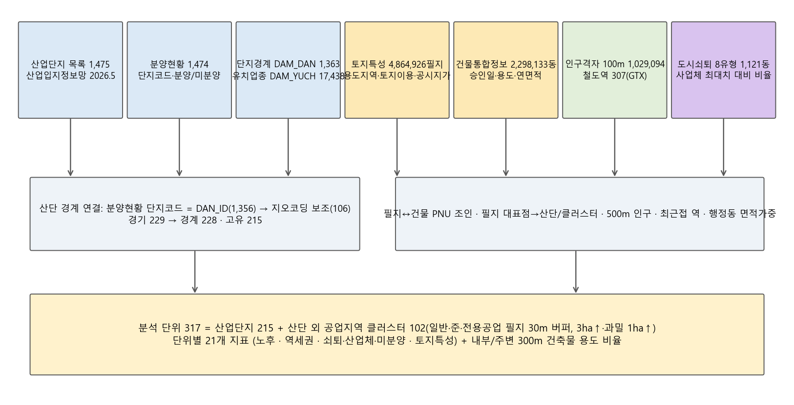

**그림 1. 분석 자료의 구성과 결합 체계**

### 3.2 산업단지 노후도 현황

경기도 산업단지 229개소는 일반 194, 도시첨단 17, 국가 17, 농공 1개소로 구성되며, 지정 후 20년 이상 경과한 산단이 83개소(36%), 30년 이상이 47개소(21%), 40년 이상이 13개소이다. 경계가 매칭되어 분석에 포함된 215개소 중 조성완료·30년 이상의 핵심 대상은 41개소, 20~29년은 31개소이다. 30년 이상 산단의 건물 노후도(30년 이상 건물 연면적 비율)는 평균 20%, 평균 사용승인연도는 2,001년으로, 산단 지정 연도가 오래되었더라도 건물은 상당 부분 재건축·증축된 곳이 많아 지정 경과연수와 건물 노후도가 반드시 일치하지 않는다는 점이 확인된다. 이는 노후도를 지정 경과와 건물 노후의 두 층위로 나누어 평가해야 하는 근거가 된다.

공간적으로는 1970~80년대 지정된 반월·시화(안산·시흥), 아산(평택), 성남일반, 서울온수(부천), 안성1·2 등이 시가지 내부에 편입되어 주거지와 접하고 있으며, 안성·파주·김포의 5~7ha 소규모 일반산단은 1990년대 개별입지 공장의 집단화를 위해 지정된 것으로 산업기능은 유지되나 기반시설이 노후한 유형이다. 과밀억제권역 14개 시에 위치한 20년 이상 산단은 11개소로, 이곳의 공업지역은 신규 지정이 금지된 제로섬 물량이므로 전환 시 회수 물량의 정책적 가치가 가장 높다.

### 3.3 역세권·도시쇠퇴·용도지역 특성

철도역 307개소 반경 1km 버퍼와 산단 경계를 교차한 결과 경기도 산단 206개 폴리곤 중 27개소가 역세권에 걸치며, 역세권 내 산단 면적은 1,570ha로 전체 산단 면적 25,577ha의 6.1%이다. 30년 이상 핵심 대상 41개소 가운데 최근접 역까지 1.5km 이내인 곳은 9개소, 1km 버퍼와 실제로 겹치는 곳은 6개소이다. 반월특수(안산신도시) 632ha, 화성일반 67ha, 수원델타플렉스 44ha, 용현(의정부) 36ha, 동두천 26ha, 서울온수 10ha가 노후하면서 역세권 면적이 큰 대표 사례이다.

도시쇠퇴 8유형을 면적 가중으로 결합하면 30년 이상 산단이 속한 행정동의 최대 면적 유형은 절대쇠퇴지역 14개소, 산업건물쇠퇴지역 13개소, 인구건물쇠퇴지역 5개소, 인구산업쇠퇴지역 4개소, 인구쇠퇴지역 3개소, 자료없음 1개소, 건물쇠퇴지역 1개소로 나타났다. 토지특성정보의 용도지역을 보면 산단 내 필지의 용도지역은 일반공업지역이 지배적이며 준공업지역 비율이 50%를 넘는 30년 이상 산단은 3개소에 그친다. 준공업지역은 국토계획법상 주거·상업 복합이 이미 허용되므로 용도지역 변경의 문턱이 낮은 반면, 일반공업지역은 준공업 또는 주거·상업으로의 변경이 필요하여 단계적 상향의 대상이 된다.

### 3.4 노후산단의 유형화

핵심 대상 41개소를 역세권(최근접 역 1.5km 이내)과 산업계 쇠퇴(산업쇠퇴·산업건물쇠퇴·인구산업쇠퇴·절대쇠퇴 행정동) 여부의 조합으로 네 유형으로 나누면 그림 2·3과 같다. Ⅰ. 역세권·산업쇠퇴형은 5개소(209ha)로 종합점수 평균 43.9점이며 대표 산단은 동두천, 동두천상봉암, 송탄이다. Ⅱ. 역세권·비쇠퇴형은 4개소(1,641ha)로 종합점수 평균 43.4점이며 대표 산단은 반월특수(안산신도시), 서울온수, 용현이다. Ⅲ. 비역세권·산업쇠퇴형은 26개소(769ha)로 종합점수 평균 33.6점이며 대표 산단은 안성제1, 향남제약, 미양농공단지이다. Ⅳ. 비역세권·비쇠퇴형은 6개소(1,458ha)로 종합점수 평균 30.0점이며 대표 산단은 아산(원정지구), 양주도하, 반월도금이다. 역세권·산업쇠퇴형(Ⅰ)은 상업·업무 전환의, 비역세권·산업쇠퇴형(Ⅲ) 가운데 주변 인구밀도가 높은 곳은 주거 전환의, 비쇠퇴형(Ⅱ·Ⅳ)은 산업 고도화의 후보군으로 해석된다.

그림 2. 30년 이상 노후산단의 유형 분포(역 거리 × 쇠퇴·사업체 감소)

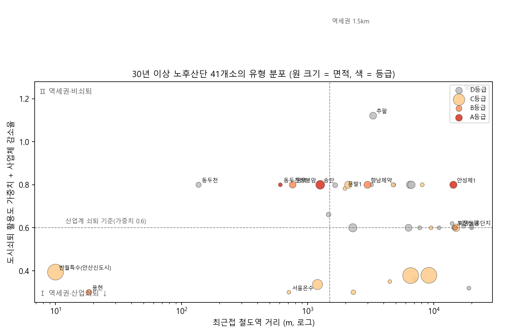

**그림 2. 30년 이상 노후산단의 유형 분포(역 거리 × 쇠퇴·사업체 감소)**

그림 3. 유형별 개소·면적·종합점수

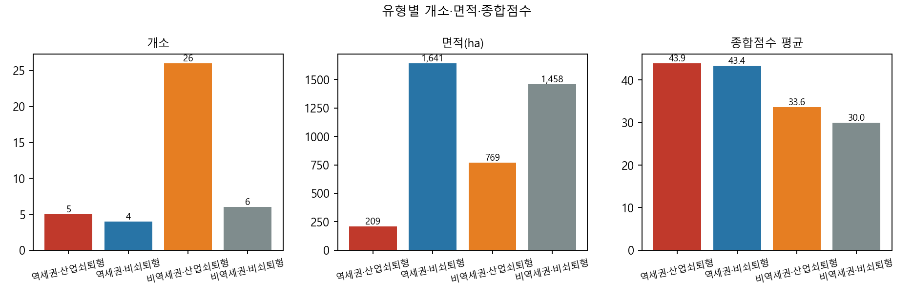

**그림 3. 유형별 개소·면적·종합점수**

### 3.5 산단 외 공업지역 클러스터의 현황

산단 경계 밖에 있는 일반·준·전용공업지역 필지를 30m 버퍼로 묶은 클러스터는 3ha 이상(과밀억제권역 1ha 이상) 기준으로 102개소, 합계 3,485ha이며, 이 가운데 과밀억제권역에 위치한 곳이 18개소이다. 클러스터의 평균 30년 이상 건물 비율은 39%, 준공업지역 비율이 50% 이상인 곳은 29개소로 산단보다 노후도와 준공업 비율이 모두 높다. 이들은 산업단지 지정·해제 절차 없이 국토계획법상 용도지역 변경만으로 전환할 수 있고 대부분 시가지 내부 역세권에 있어 회수 물량의 단위 면적당 정책 가치가 높다. 다만 필지가 세분되어 소유자가 많고 개별 공장이 가동 중인 경우가 많아 블록 단위 정비사업이나 소규모 정비 방식과 결합할 필요가 있다.

## 4. 전환 우선순위 분석

### 4.1 분석의 틀: 4대 로직과 지표체계

평가모형은 그림 4와 같이 산업체 감소 전제 단계와 ① 노후도(30점) ② 역세권 근접성(20점) ③ 도시쇠퇴·산업체 감소·미분양(25점) ④ 토지특성·종상향 조건(25점)의 4대 로직 21개 지표로 구성된다(표 1). 전제 단계는 "산업용도를 버리고 다른 용도로 가는" 결정의 1차 조건으로서, 대상지가 속한 행정동의 사업체 수가 관측기간 최대치 대비 감소했는지(busi_to_max<0.95) 또는 도시재생법의 사업체 쇠퇴 기준(최대치 대비 5% 이상 감소 또는 3년 연속 감소)에 해당하는 면적이 절반 이상인지를 묻는다. 이 전제를 충족하지 못한 단위는 노후·역세권 점수가 높더라도 산업이 유지되고 있으므로 A·B등급에서 제외하고 "산업 유지"로 분류한다. ① 노후도는 산단 지정 경과연수(10), 30년 이상 건물 연면적 비율(10), 평균 사용승인연도(5), 2층 이하 저층 비율(5)로, ② 역세권은 최근접 역 거리(10), 역세권 1km 면적비율(6), GTX역 거리(4)로, ③ 도시쇠퇴·산업체 감소·미분양은 최대치 대비 사업체 감소율(8), 사업체 쇠퇴 행정동 면적비(5), 8유형에 부여한 활용도 가중치(산업쇠퇴 1.0 > 산업건물·인구산업쇠퇴 0.8 > 절대쇠퇴 0.6 > 인구건물 0.35 > 건물·인구쇠퇴 0.3 > 성장 0)의 면적 가중 평균(7), 그리고 산업단지 분양현황(2026.7)의 산단 자체 미분양율(3, 0~30%)과 같은 시군 산단 전체의 공고면적 가중 미분양율(2, 0~20%)로 측정한다. 미분양은 산업용지 수요가 이미 소진되었음을 뜻하므로 산업용도를 포기하고 다른 용도로 전환할 정당성을 높이는 지표이며, 산단 자체가 완판된 경우에도 같은 시군의 신규 산단이 대량 미분양이면 지역 산업용지 수요가 약하다고 본다. 산업만 쇠퇴하고 인구·건물이 유지되는 지역을 가장 높게 두는 것은, 그곳이 산업기능은 잃었으나 주거·상업 수요는 살아 있어 전환의 활용도가 높기 때문이며, 모든 지표가 쇠퇴한 절대쇠퇴지역은 전환 후 수요 자체가 불확실하므로 그 다음에 둔다.

④ 토지특성·종상향 조건은 용도전환의 법적 문턱과 시장성을 함께 담는다. 준공업지역 비율(6)과 공업 용도지역 비율(4)은 변경 절차의 난이도를, 토지이용상황의 비공업 비율(7)·비공장 연면적 비율(5)·나지 비율(3)은 산업기능 상실 정도를, 같은 법정동 주거지 공시지가 대비 공업지 지가의 격차(5)는 전환 프리미엄을, 낮은 용적률(5)은 고밀화 여지를 나타낸다. 지표는 5~95 분위를 기준으로 Min-Max 표준화하고 거리·연도·용적률은 역방향으로 처리하였다.

그림 4. 분석의 틀

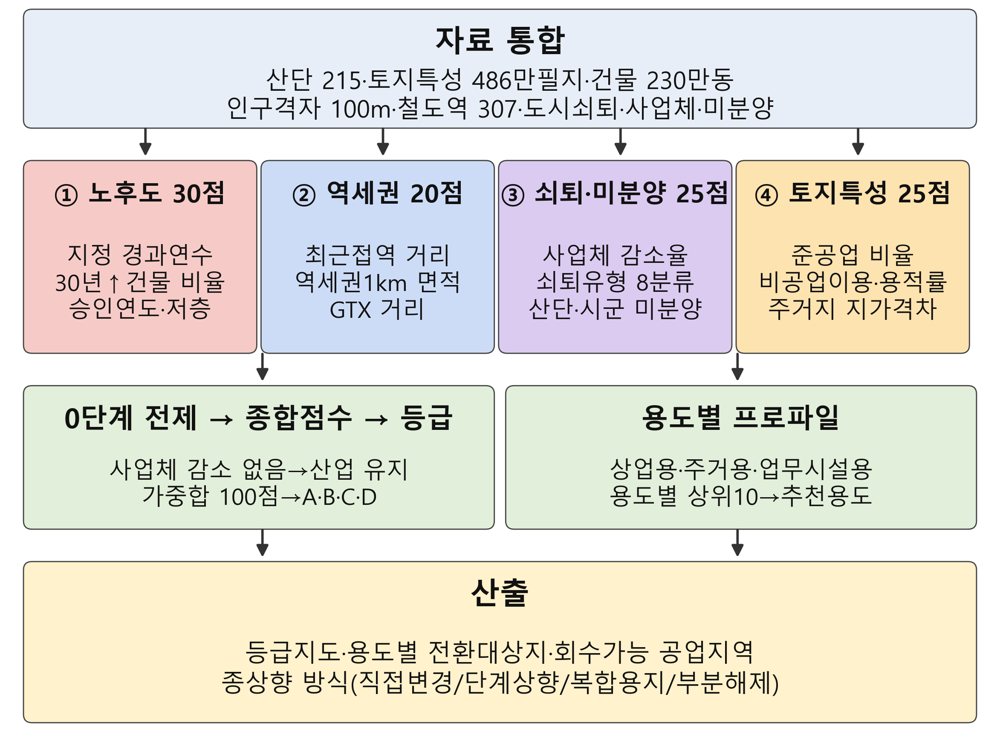

**그림 4. 분석의 틀**

표 1. 전제 단계와 4대 로직 지표체계·배점(종합)

**표 1. 전제 단계와 4대 로직 지표체계·배점(종합)**

| 로직(배점) | 지표 | 측정 | 방향 | 배점 |

|---|---|---|---|---|

| ① 노후도(30) | 산단 지정 경과연수 | 2026-지정연도 | + | 10 |

|  | 30년 이상 건물 연면적 비율 | PNU 조인 건물 | + | 10 |

|  | 평균 사용승인연도 | 건물 | − | 5 |

|  | 2층 이하 저층 비율 | 건물 | + | 5 |

| ② 역세권(20) | 최근접 철도역 거리 | 0~3km | − | 10 |

|  | 역세권 1km 면적비율 | 경계∩버퍼 | + | 6 |

|  | GTX역 거리 | 0~5km | − | 4 |

| 전제 | 산업체 감소 여부 | 1−busi_to_max ≥5% 또는 사업체 쇠퇴 행정동 ≥50% | 통과/제외 | — |

| ③ 도시쇠퇴·산업체감소·미분양(25) | 최대치 대비 사업체 감소율 | 1−busi_to_max, 0~30% | + | 8 |

|  | 사업체 쇠퇴 행정동 면적비 | 도시재생법 기준 | + | 5 |

|  | 8유형 활용도 가중치 | 면적가중 평균 | + | 7 |

|  | 산단 미분양율 | 분양현황 2026.7, 0~30% | + | 3 |

|  | 시군 산단 미분양율 | 공고면적 가중, 0~20% | + | 2 |

| ④ 토지특성·종상향(25) | 준공업지역 비율 | 용도지역1 | + | 5 |

|  | 공업 용도지역 비율 | 용도지역1 | + | 3 |

|  | 비공업 토지이용 비율 | 토지이용상황(도로·하천 제외) | + | 5 |

|  | 비공장 연면적 비율 | 건축물용도 | + | 4 |

|  | 나지 비율 | 토지이용상황 | + | 2 |

|  | 주거지 대비 지가격차 | 법정동 주거지가÷공업지가 | + | 4 |

|  | 용적률 | 연면적÷대지면적 | − | 2 |

용도별 순위는 동일 지표에 용도별 가중치 프로파일을 적용해 산출하였다(그림 5). 프로파일의 지표 선택과 방향은 2.4절의 문헌에서 도출한 용도별 판정 조건을 따른다. 상업용은 역 거리·역세권 면적·상업지 지가 격차·인구밀도를, 주거용은 인구밀도·주거 인접률·주거지 지가 격차·필지 규모를, 업무시설용은 역·GTX 거리·과밀억제권역 여부·저용적률·산업쇠퇴 가중치를 높게 두었다. 게이트 조건으로 지정 20년 미만 산단, 건물 3동 미만, 그리고 30년 이상 건물 비율 10% 미만이면서 비공장 연면적 비율 15% 미만인 가동 산단을 D(보호)로 고정하였고, 나머지를 종합점수 순위 상위 15%를 A(전환 우선), 15~40%를 B(복합화), 그 이하를 C(고도화 유지)로 판정하였다. 회수 가능 공업지역 면적은 A등급 면적×공업 용도지역 비율, B등급은 그 50%로 산정하였다.

그림 5. 용도별 가중치 프로파일

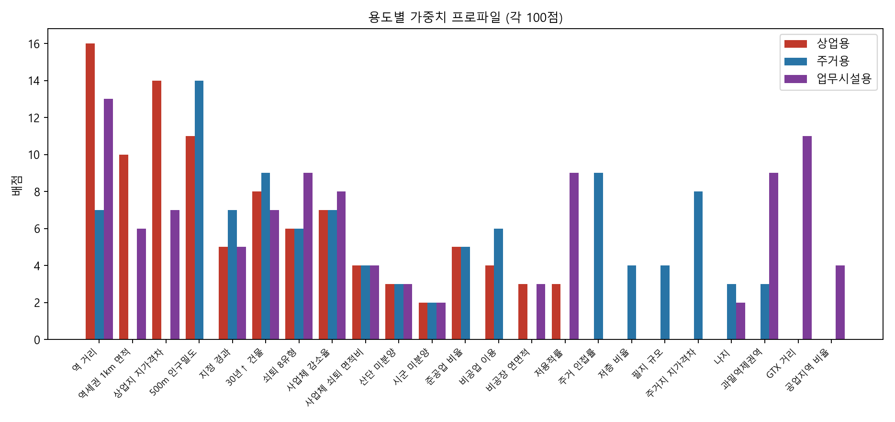

**그림 5. 용도별 가중치 프로파일**

### 4.2 종합 우선순위와 등급

분석 단위 317개소 가운데 산업체 감소 전제를 충족한 단위는 240개소이며, 전제를 충족하지 못해 "산업 유지"로 분류된 단위는 30개소이다. 게이트와 전제를 통과한 단위를 대상으로 등급을 판정한 결과 A등급 12개소, B등급 18개소, C등급 76개소, D등급 211개소로 나타났다(그림 2). 산업단지 중 A등급은 3개소로 동두천상봉암, 송탄, 안성제1 등이며, 30년 이상 핵심 대상의 종합 상위 20개소의 로직별 점수 구성은 그림 7과 같다. 상위 산단은 공통적으로 지정 40년 이상, 30년 이상 건물 비율이 높고, 최근접 역 1km 내외, 산업계 쇠퇴 행정동, 주거지 인접이라는 특성을 보인다. 가중합 순위와 TOPSIS 순위가 모두 상위 20%에 드는 강건 후보는 10개소로, 가중치 변화에도 순위가 안정적인 대상지이다.

그림 6. 전환 우선순위 등급 분포

**그림 6. 전환 우선순위 등급 분포**

그림 7. 30년 이상 노후산단 종합 상위 20의 로직별 점수 구성

**그림 7. 30년 이상 노후산단 종합 상위 20의 로직별 점수 구성**

### 4.3 용도별 전환 대상지 상위 10개소

상업·주거·업무시설 용도별 상위 10개소는 그림 8(점수)·그림 9(위치)와 같고, 상위 15개소의 내부·주변 300m 건축물 용도 구성은 그림 10과 같다. 상업용 상위에는 용현, 동두천상봉암, 동두천, 서울온수, 평택가, 주거용 상위에는 용현, 안성제1, 평택, 송탄, 서울온수가, 업무시설용 상위에는 용현, 동두천상봉암, 서울온수, 동두천, 평택가 포함되었다. 세 용도에 공통으로 상위에 오르는 산단은 역세권이면서 도심에 포위된 소규모 노후산단으로, 어떤 용도로 전환하더라도 시장성이 확보되는 곳이다. 반면 역에서 멀고 주변 인구가 적은 대규모 노후산단(아산 포승·원정, 안성 1·2 등)은 노후도만으로는 상위에 오르지만 용도별 점수에서는 밀려나 산업 고도화 대상으로 분류되는 것이 합리적임을 보여준다.

그림 8. 용도별 전환 상위 10 (점수)

**그림 8. 용도별 전환 상위 10 (점수)**

그림 9. 용도별 전환 상위 10의 위치

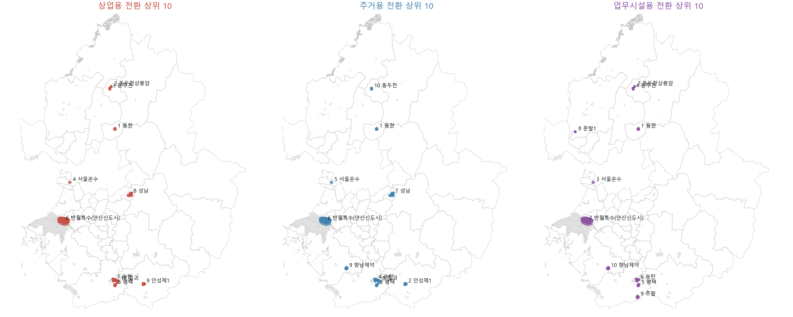

**그림 9. 용도별 전환 상위 10의 위치**

그림 10. 종합 상위 15 산단의 내부·주변 300m 건축물 용도 구성

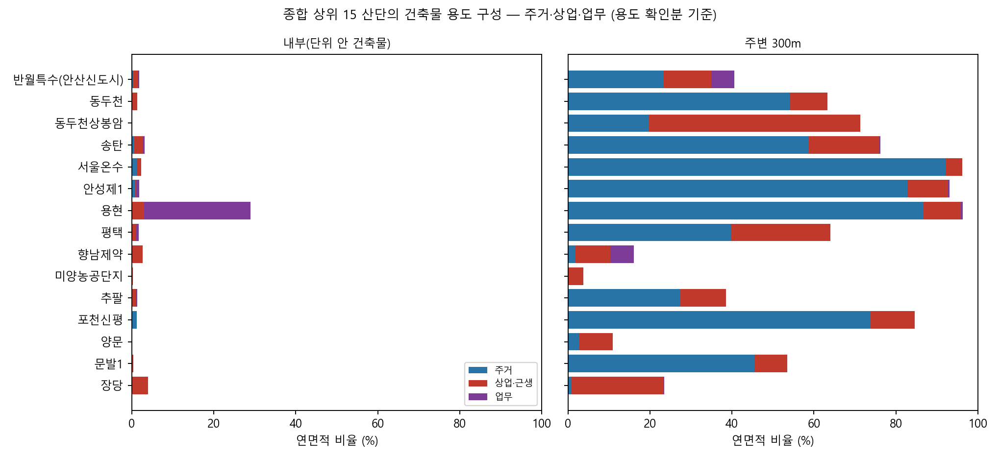

**그림 10. 종합 상위 15 산단의 내부·주변 300m 건축물 용도 구성**

### 4.4 용도 판정 규칙과 쇠퇴유형별 전환 용도

2.4절의 문헌에서 도출한 판정 조건을 그림 11의 규칙으로 정리하고 이를 가중치 프로파일로 구현하였다. 세 프로파일 점수의 최댓값이 추천 용도가 되며, A·B등급 대상지 30개소의 추천 용도를 도시쇠퇴 유형과 교차하면 그림 12와 같다. 산업건물쇠퇴지역은 상업용 3개소, 주거용 3개소으로 나타났다. 산업쇠퇴지역은 업무시설용 1개소으로 나타났다. 인구산업쇠퇴지역은 상업용 4개소, 주거용 5개소, 업무시설용 5개소으로 나타났다. 자료없음은 상업용 1개소으로 나타났다. 절대쇠퇴지역은 상업용 4개소, 주거용 2개소, 업무시설용 2개소으로 나타났다. 이 교차는 세 가지 규칙성을 보여준다. 첫째, 산업건물쇠퇴·인구산업쇠퇴 행정동의 노후산단은 상업 또는 업무 추천이 많은데, 이곳은 인구·건물은 유지되면서 사업체만 줄어 역세권 상권과 업무 수요가 살아 있기 때문이다. 둘째, 절대쇠퇴 행정동의 대상지는 주거 추천이 우세한데, 인구·산업·건물이 모두 쇠퇴한 곳은 상업·업무 수요를 기대하기 어려워 공공주택 등 주거 공급이 현실적이기 때문이다. 셋째, 인구건물쇠퇴·인구쇠퇴 행정동(산업은 유지)의 산단은 전제 단계에서 대부분 걸러져 산업 유지로 분류되었다.

용도별 상위 산단의 건축물 용도 구성(그림 10)은 판정의 타당성을 뒷받침한다. 주거 추천 상위 산단은 주변 300m 건물 연면적의 주거 비율이 36%로, 상업 추천 산단(49%)이나 업무 추천 산단(nan%)보다 높고, 상업 추천 산단은 주변 상업·근생 비율(28%)이 가장 높다. 산단 내부는 대부분 공장·창고여서 용도 구성이 판정을 가르지 못하지만, 경계 밖 300m의 용도 구성은 대상지가 이미 어떤 도시 기능에 둘러싸여 있는지를 보여 주므로 전환 용도의 실증 근거가 된다.

그림 11. 전환 용도 판정 규칙

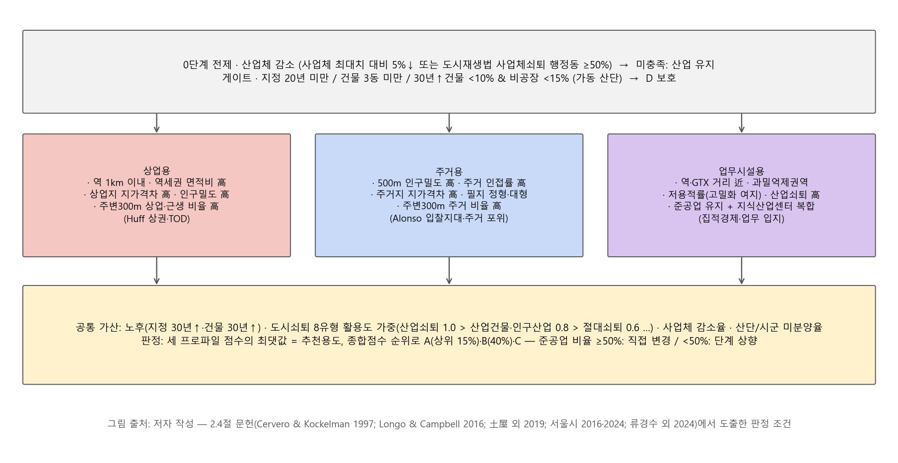

**그림 11. 전환 용도 판정 규칙**

그림 12. A·B등급 대상지의 도시쇠퇴 유형 × 추천 용도

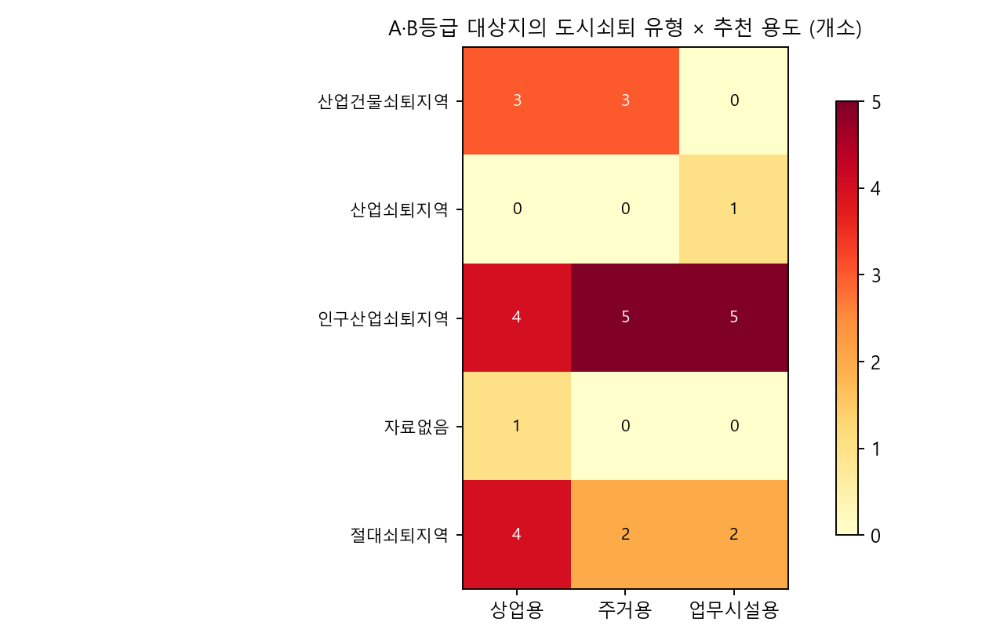

**그림 12. A·B등급 대상지의 도시쇠퇴 유형 × 추천 용도**

### 4.5 종상향 방식과 회수 가능 물량

A·B등급 대상지의 용도지역 변경 방식은 준공업지역 비율을 기준으로 두 갈래로 나뉜다. 준공업지역 비율이 50% 이상인 곳은 국토계획법상 이미 주거·상업 복합이 허용되므로 지구단위계획으로 준주거·일반상업으로 직접 변경하거나 준공업을 유지한 채 용적률을 상향(서울시 방식 250→400%)하고 산업부지 연동률을 부과하는 방식이 적합하다. 일반공업지역이 지배적인 곳은 일반공업→준공업→준주거·상업의 단계적 상향으로 1단계에서 산업·주거 공존을 허용하고 실적에 따라 2단계로 진행하는 방식이 갈등을 줄인다. 재생사업지구로 이미 지정된 성남·반월·시화·평택은 산업입지법의 복합용지 공모 경로를, 대규모 단일 소유 블록은 산단 부분해제 후 공공주택지구 지정을 병행할 수 있다. 전환 시 회수 가능한 공업지역 면적은 A등급 288ha를 포함해 총 874ha로 추정되며, 이는 2024~2026년 경기도 성장관리권역 공업지역 배정 물량(266.6만㎡, 약 267ha)의 328%에 해당한다.

그림 13. A·B등급 산단의 회수 가능 물량과 종상향 방식

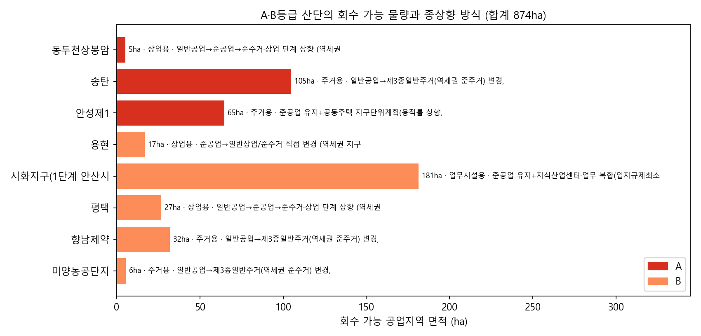

**그림 13. A·B등급 산단의 회수 가능 물량과 종상향 방식**

### 4.6 산단 외 공업지역 클러스터의 우선순위

클러스터 102개소를 산단과 별도로 등급화한 결과 A등급 9개소, B등급 13개소가 도출되었으며, 종합 상위에는 양주시 덕계동 공업지역, 부천시 소사구 송내동 공업지역, 남양주시 다산동 공업지역, 양주시 덕정동 공업지역, 안양시 동안구 호계동 공업지역, 수원시 장안구 이목동 공업지역 등이 포함되었다. 상위 클러스터의 공통 특성은 역 500m 이내, 준공업지역 비율 100%, 30년 이상 건물 비율 60% 이상, 산업건물·인구산업쇠퇴 행정동이라는 점으로, 산단보다 규모는 작지만 전환의 법적 문턱이 낮고 시장성이 확실한 "즉시 전환 가능지"에 해당한다. 클러스터의 회수 가능 공업지역 면적은 합계 437ha로, 산단 437ha에 비해 작지만 대부분 과밀억제권역 물량이어서 3기 신도시 자족용지 등 대체지정 수요지와의 공간적 정합성이 높다.

그림 14. 산단 외 공업지역 클러스터 종합 상위 15

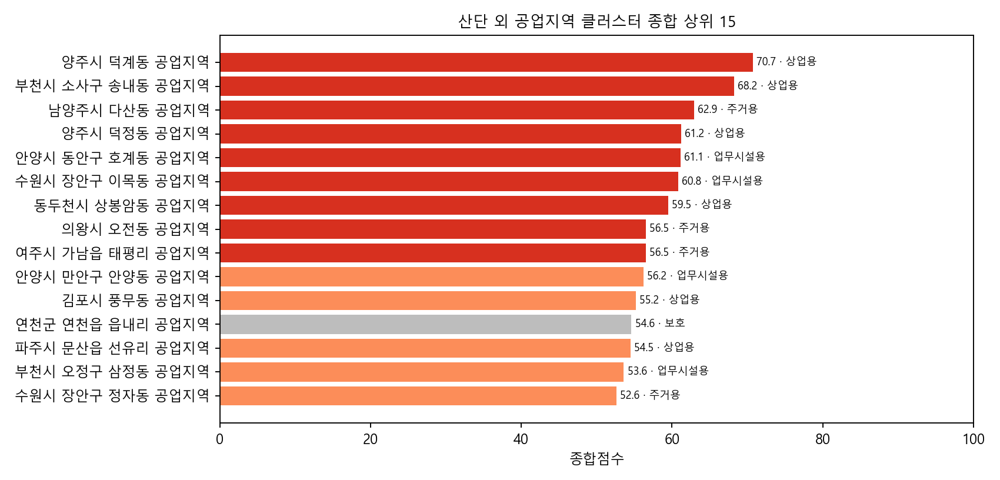

**그림 14. 산단 외 공업지역 클러스터 종합 상위 15**

시군별로 보면 A·B등급 대상지는 안양시(4개소), 동두천시(4개소), 양주시(3개소), 평택시(3개소), 부천시(2개소), 수원시(2개소), 화성시(2개소), 안성시(2개소) 등에 분포하여, 안산·평택·의정부·부천·동두천의 노후산단과 양주·안양·수원·남양주의 도심 준공업지역이 전환 정책의 1차 대상 권역으로 나타났다.

### 4.7 소결

분석 결과를 요약하면 첫째, 지정 경과연수만으로 정한 노후산단 목록과 실제 산업기능 상실 정도는 일치하지 않으며, 건물 노후·비공업 잠식·지가 격차를 결합해야 전환 대상이 선별된다. 둘째, 역세권 근접성과 산업계 쇠퇴유형은 상업·업무 전환 적합지를, 주변 인구밀도와 주거 인접률은 주거 전환 적합지를 판별하는 핵심 변수로 작동하였다. 셋째, 준공업지역 비율은 전환의 법적 문턱을 결정하므로 대상지별 종상향 경로를 사전에 분기하는 기준이 된다. 넷째, 전환 상위 대상지는 대부분 과밀억제권역과 그 인접 시에 분포하여 회수 물량이 대체지정 수요지(3기 신도시·반환공여구역)와 공간적으로 가깝다는 점에서 물량 순환 모델의 실현 가능성이 확인된다.

## 5. 결    론

본 연구는 경기도 산업단지 215개소와 산단 외 공업지역 클러스터를 대상으로 노후도·역세권·도시쇠퇴·토지특성의 4대 로직을 결합한 전환 우선순위 평가모형을 구축하고, 490만 필지와 230만 동의 건물을 결합한 실측 자료에 적용하여 상업·주거·업무 용도별 상위 대상지와 회수 가능 물량을 도출하였다. 연구의 의의는 노후산단의 재생 여부를 넘어 "어느 산단을 무엇으로 바꾸어 어느 정도의 공업지역 물량을 회수할 수 있는가"를 광역 단위에서 정량화한 데 있으며, 평가지표와 가중치를 공개하여 복합용지 지정과 대체지정 심의에서 반복되어 온 특혜 논란을 줄일 수 있는 투명한 선정 근거를 제공한다.

용도 판정과 관련해 본 연구는 노후산단의 전환 용도가 "어디에 있는가"보다 "무엇에 둘러싸여 있고 그 지역의 무엇이 쇠퇴했는가"로 갈린다는 점을 실증하였다. 인구·건물은 유지되고 사업체만 줄어든 역세권 산단은 상업·업무로, 인구·산업·건물이 모두 쇠퇴한 곳은 공공주택 중심의 주거로, 사업체가 유지되는 곳은 노후하더라도 산업 고도화로 가는 것이 문헌과 자료 모두에서 일관된 방향이며, 이 규칙은 그림 11과 같이 명시적 판정 기준으로 공개할 수 있어 복합용지 지정의 특혜 논란을 줄이는 데 기여한다.

정책적으로는 ① 등급 지도를 경기도 공업지역 총량계정과 대체지정 계획의 기초자료로 채택하고, ② A등급 대상지에 대해 재생사업지구 복합용지 공모형과 산단 부분해제형 시범사업을 병행하며, ③ 산업입지법 재투자·산업집적법 지가차액·국토계획법 공공기여로 삼중 부과되는 개발이익 환수를 단일 기준으로 통합해 첨단산단 조성과 이전기업 지원에 재투자하는 기금을 두고, ④ 전환 대상지에는 서울시식 산업부지 연동률을 적용해 산업 바닥면적의 순손실을 억제할 것을 제안한다.

연구의 한계는 다음과 같다. 첫째, 산업기능 상실을 건물 용도와 토지이용상황으로 대리 측정하였으므로 공장등록·가동률·고용 자료로 검증이 필요하다. 둘째, 가중치는 정책 목적에 따른 규범적 설정으로 전문가 AHP와 민감도 분석을 통한 보정이 요구된다. 셋째, 토양오염·이전기업 대책·소유 구조 등 실행 단계의 제약은 반영하지 못하였다. 향후 대상지별 사업성 분석과 이해관계자 협의 절차를 결합한 실행 모형으로 확장할 필요가 있다.

## 참고문헌

1. Alonso, W. (1964). Location and land use: Toward a general theory of land rent. Harvard University Press.

2. Baek, S., & Lee, H. (2023). A study on the improvement of laws and systems related to industrial facilities for urban management of industrial areas: Focusing on semi-industrial areas in Seoul. The Korea Spatial Planning Review, 145-165.

3. Cervero, R., & Kockelman, K. (1997). Travel demand and the 3Ds: Density, diversity, and design. Transportation Research Part D, 2(3), 199-219.

4. Chrysochoou, M., Brown, K., Dahal, G., Granda-Carvajal, C., Segerson, K., Garrick, N., & Bagtzoglou, A. (2012). A GIS and indexing scheme to screen brownfields for area-wide redevelopment planning. Landscape and Urban Planning, 105(3), 187-198.

5. City of Chicago. (2017). North Branch Framework and Industrial Corridor System Fund Ordinance (Municipal Code Chapter 16-8).

6. Federation of Korean Industries. (2010). Status of former factory sites in semi-industrial areas and measures to promote development (Regulatory Reform Series 3).

7. Ferm, J., & Jones, E. (2016). Mixed-use "regeneration" of employment land in the post-industrial city: Challenges and realities in London. European Planning Studies, 24(10), 1913-1936.

8. Greater London Authority. (2021). The London Plan 2021: Policies E4-E7, Land for industry, logistics and services.

9. Gyeonggi Research Institute. (2025). Measures to improve the operational efficiency of industrial zones in the overconcentration control region.

10. Huff, D. L. (1963). A probabilistic analysis of shopping center trade areas. Land Economics, 39(1), 81-90.

11. Jeong, S. (2018). An analysis of the revitalization plan for the old industrial complex: The case of Seongnam Industrial Complex. Journal of the Association of Korean Photo-Geographers, 28(4).

12. Journal of Urban Planning and Development. (2024). Spatial variation of industrial land conversion and its influential factors in urban redevelopment in China: Case study of Shenzhen, 150(2).

13. Kim, J. (2020). Criteria for selecting mixed-use land and improvement of development systems for the regeneration of aged industrial complexes: The case of Jinju Sangpyeong Industrial Complex (KRIHS Working Paper 20-03). Korea Research Institute for Human Settlements.

14. Kim, J., & Byun, B. (2018). A study on a type of regeneration project on old industrial complex. Journal of the Economic Geographical Society of Korea, 21(2).

15. Lai, Y., et al. (2020). Transformation of industrial land in urban renewal in Shenzhen, China. Land, 9(10), 371.

16. Longo, A., & Campbell, D. (2016). The determinants of brownfields redevelopment in England. Environmental and Resource Economics, 67, 261-283.

17. Ministry of Land, Infrastructure and Transport. (2026). Operational guidelines for the substitute designation of industrial zones.

18. Nam, J. (2022). Types of declining cities and urban management strategies for smart shrinkage: Focusing on overseas cases. Gyeonggi Research Institute.

19. Park, H., Park, J., & Jang, S. (2018). Analysis of efficient implementation strategies for industrial complex regeneration plans through the competitiveness enhancement project of aged industrial complexes. Journal of the Residential Environment Institute of Korea, 16(3).

20. Park, K., & Lee, M. (2020). Development of location evaluation indicators for regenerating urban aged industrial complexes into urban high-tech industrial complexes. Journal of the Korean Regional Development Association, 32(5).

21. Ryu, K., Choi, Y., & Park, S. (2024). A study on the improvement of semi-industrial areas for introducing residential functions: Focusing on Daegu. Journal of Regional Industry Research, 47(3), 167-190.

22. Seoul Metropolitan Government. (2016). 2030 Comprehensive development plan for semi-industrial areas.

23. Seoul Metropolitan Government. (2024). Improvement plan for the semi-industrial area system.

24. Thomas, M. R. (2002). A GIS-based decision support system for brownfield redevelopment. Landscape and Urban Planning, 58(1), 7-23.

25. Tsuchiya, T., Nakai, N., & Numata, M. (2019). A study on land use conversion of large-scale former factory sites in Kanagawa Prefecture. Journal of the City Planning Institute of Japan, 54(3), 1237-1244.

* 경기연구원 선임연구위원, 공학박사